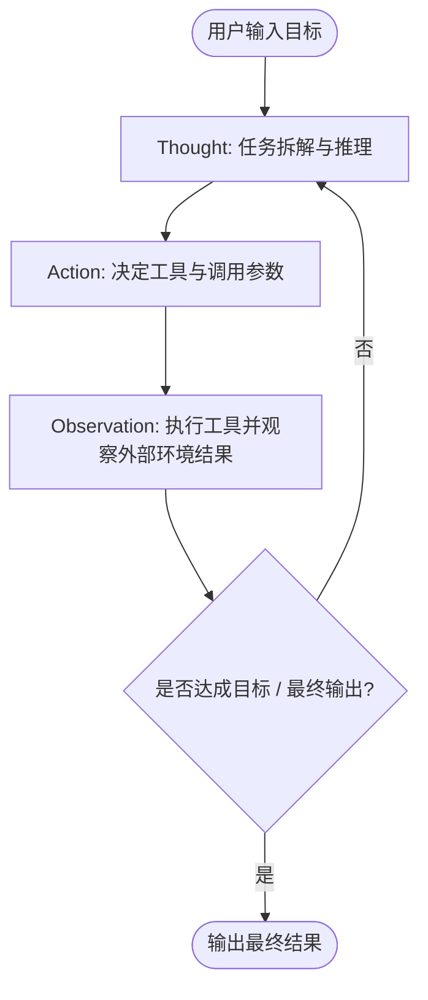

# ReAct Agent 理论基础

ReAct（Synergizing **Rea**soning and **Act**ing）是由普林斯顿大学与 Google Research 于 2022 年（ICLR 2023）提出的经典智能体交互范式。它打破了传统大语言模型仅能执行“静态生成”或“盲目工具调用”的局限，建立了**思考与行动紧密协同**的动态循环。

---

## 为什么需要 ReAct 范式？

在智能体演进历程中，大模型应用面临两大典型困境：

| 范式类型 | 代表方案 | 核心优势 | 致命短板 |
|---|---|---|---|
| **仅推理（Reasoning Only）** | Chain-of-Thought (CoT) | 具备强大的多步推理与上下文拆解能力。 | 无法获取外部事实与实时信息，容易产生严重**模型幻觉**与知识滞后。 |
| **仅行动（Acting Only）** | 传统的 Function Calling / API 规则匹配 | 能够执行外部工具获取真实数据。 | 缺乏推理意图规划，难以处理多轮依赖、错误恢复或开放式复杂目标。 |

ReAct 范式将两者有机融合：**用推理指导下一步应该采取什么行动；用行动带来的真实观察结果纠正和调整推理路径**。

---

## 核心交互循环：Thought - Action - Observation

在 ReAct Agent 的生命周期中，模型在循环中不断生成并消费三元组：

### 1. 思考（Thought）
模型基于当前的上下文、历史对话及此前所有的观察结果，进行显式的逻辑推理与状态评估：
- 当前问题已经解决了哪些子目标？
- 还缺少什么关键信息？
- 接下来应该调用哪个工具，或者是否已经可以作答？

### 2. 行动（Action）
根据思考结论，模型选择一个具体的动作：
- **工具调用（Tool Call）**：指定需要调用的工具名称（Tool Name）及结构化参数（Arguments）。
- **完成响应（Finish）**：判断任务已完成，向用户输出最终答案。

### 3. 观察（Observation）
智能体运行时捕获工具执行的真实结果（如数据库查询记录、搜索引擎网页摘要、计算器数值），并将这些客观数据以 `ToolResponseMessage` 形式注入上下文。

随后，智能体进入下一轮“思考”，评估该结果是否符合预期，必要时动态调整后续执行策略。

---

## 决策状态机与停机条件

为保障工程运行时的安全可控，避免大模型陷入死循环或消耗过多 Token，ReAct Agent 运行时内置了严格的状态机判定：

1. **达到最终答案（Final Answer）**：模型未发起任何 Tool Call，直接生成对用户的解答，智能体正常退出循环。
2. **达到最大迭代步数（Max Iterations）**：防止因工具异常或逻辑死锁导致无限循环，超过设定步数后强制挂起或兜底返回。
3. **人工介入拦截（HITL Interrupt）**：在关键风险工具执行前（如转账、删除数据库），触发拦截器挂起等待人工确认。
4. **上下文溢出控制**：当多轮观察结果累积过大时，结合短期记忆窗口（Memory Window）或摘要压缩机制保证推理稳定。

---

## 在 ARGI 中的工程映射

在框架底层，`ReactAgent` 被设计为一个自包含的图工作流节点拓扑：
- **Model 节点**：负责生成 Thought 与 Tool Calls。
- **Tool 节点**：负责并发安全地执行工具并将 Observation 写回状态。
- **Condition 边**：判定是继续循环调用工具，还是终止并交付给用户。
